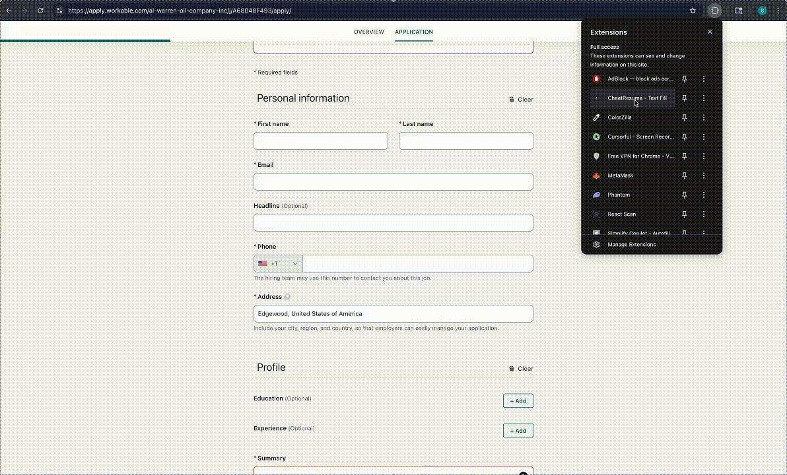

# CheatResume - Text Fill

A Chrome extension that generates contextual responses for job application forms using your resume and the job description.

## How It Works



## Overview

Text Fill analyzes job postings and uses AI to draft personalized answers for application questions. It extracts job descriptions automatically from platforms like Ashby, Greenhouse, Lever, and Workable, then generates responses tailored to your background.

## Supported AI Providers

- **OpenAI**: GPT-5 Nano, GPT-5 Mini
- **Anthropic**: Claude Sonnet 4.5, Claude Haiku 3.5
- **Google**: Gemini 3 Pro, Gemini 3 Flash

## Installation

1. Clone or download this repository
2. Open `chrome://extensions` in Chrome
3. Enable Developer mode (toggle in top right)
4. Click "Load unpacked" and select the project directory

## Configuration

1. Click the extension icon in Chrome toolbar
2. Select "Open Settings"
3. Choose your AI provider and model
4. Enter the corresponding API key
5. Upload your resume (PDF or text file) or paste the content directly

### API Keys

Obtain keys from:
- OpenAI: https://platform.openai.com/api-keys
- Anthropic: https://console.anthropic.com/settings/keys
- Google AI: https://aistudio.google.com/apikey

## Usage

1. Navigate to any job application page
2. Locate a text field (textarea or text input)
3. Click the circular button that appears on the field
4. Wait for the AI to generate and insert the response

The extension automatically:
- Extracts job descriptions from Overview/Description tabs
- Caches job context per URL to avoid redundant extraction
- Detects question context from labels and surrounding content

## Technical Details

### File Structure

```
text-fill/
├── manifest.json       # Extension configuration
├── background.js       # Service worker, API requests
├── contentScript.js    # DOM manipulation, field detection
├── contentStyles.css   # Injected styles
├── options.html/js/css # Settings page
├── popup.html/js/css   # Toolbar popup
├── pdf.min.js          # PDF.js library
├── pdf.worker.min.js   # PDF.js web worker
├── pdf-lib.js          # PDF extraction wrapper
└── logo.png            # Extension icon
```

### Permissions

- `storage`: Save settings and resume locally
- `activeTab`: Access current tab content
- Host permissions for API endpoints

### Job Description Extraction

The extension uses multiple strategies to find job descriptions:
1. Searches for semantic markers (responsibilities, requirements, qualifications)
2. Checks hidden tab panels (Ashby Overview tabs)
3. Programmatically switches tabs if needed
4. Caches results in sessionStorage per job URL

### PDF Parsing

Uses Mozilla's pdf.js library (v3.11.174) for text extraction. Handles LaTeX-generated PDFs, Word exports, and standard document formats.

## Development

No build step required. Edit files directly and reload the extension from `chrome://extensions`.

To test changes:
1. Make edits to source files
2. Click the refresh icon on the extension card
3. Reload the target page

## Links

- Website: https://www.cheatresume.com/
- Repository: https://github.com/sajanpoudel/text-fill

## License

MIT
