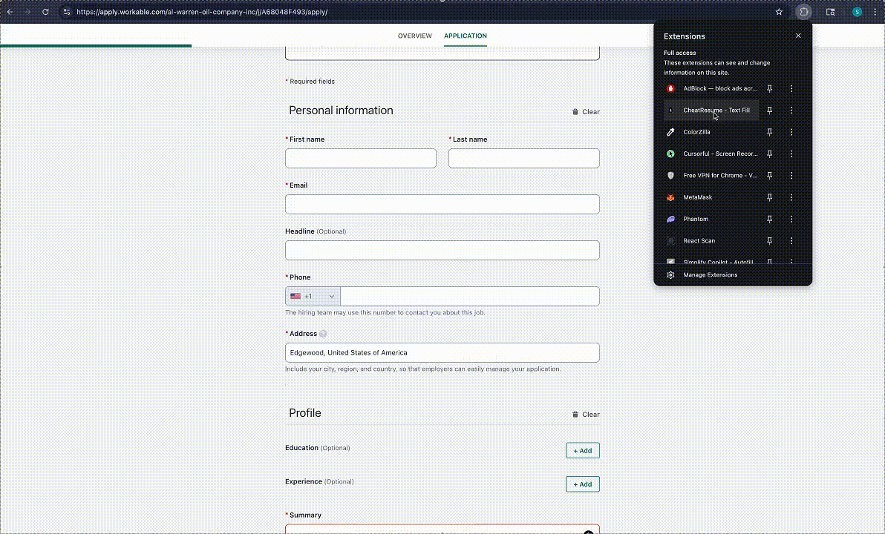

# Text Fill

**Your browser companion that learns who you are and helps you write -  everywhere.**

Text Fill lives in your browser and watches your back. It learns your voice, remembers what matters to you, and helps you write better responses across every site you use -  emails, job applications, LinkedIn messages, tweets, comments, forms, and more.

The longer you use it, the better it knows you.



---

## What It Does

Most writing tools make you repeat yourself. You paste your resume every time, re-explain your background, switch between modes. Text Fill doesn't work that way.

It builds a living memory of you -  your job, your skills, your tone, how you write, what you care about. Every time you generate something, it pulls in the context that actually matters for that specific moment. On LinkedIn, it knows your work story. On Twitter, it matches your voice. On a job board, it reads the job description and connects it to your experience automatically.

**Single-click** the icon next to any text field to open the action menu.
**Double-click** to generate instantly with no menu.

---

## Memory -  The Core

Text Fill learns from you over time. As you generate, it quietly extracts facts worth remembering:

- **Work** -  your job title, skills, projects, career goals, companies you're targeting
- **Social** -  your interests, communities, how you spend your time
- **Personal** -  your name, location, values, relationships
- **Persona** -  your writing voice: the words you use, the rhythm of your sentences, what makes your writing distinctly yours

Memory is selective. It only saves things it's genuinely confident about (85%+ threshold). Persona -  your writing identity -  is held to an even higher bar (95%) because it should only reflect patterns that are unmistakably you, drawn from your own words, not from what the AI generated.

### Semantic Search

When you have an OpenAI or Gemini API key, Text Fill uses vector embeddings to find the most relevant memories for each context -  not just keyword matching, but genuine semantic similarity. The right facts surface at the right moment.

### Forgetting Curve

Memories don't last forever. Text Fill uses a spaced-repetition forgetting model inspired by Ebbinghaus: memories you haven't used or reinforced in a while gradually fade. High-value memories archive before they delete. Low-value ones are quietly cleaned up. The system self-maintains -  you never have to manage it manually.

**Caps:** 500 active memories, 200 archived. 

### Managing Memory

Open **Settings → Manage Memory** to see everything Text Fill has learned:

- Browse by category (Work, Social, Personal, Persona, Archived)
- Search across all memories
- Edit, delete, or restore individual entries
- See forget pressure bars on each card (how close to archiving)
- Cluster view groups related memories visually using k-means on their embeddings
- Optimize & Deduplicate removes low-value entries automatically

---

## Context Library

Sometimes the context you need is on a different page. The floating button at the bottom-right of every page opens the **Context Library** -  a cross-tab context manager.

Save any page as context (a job description, a company's about page, a person's LinkedIn profile) and it's automatically included in your next generation, no matter which tab you're writing from.

Active contexts show a blue dot on the field button. Toggle them on/off. Clear them when you're done.

---

## Platform Awareness

Text Fill detects which site you're on and automatically applies the right writing style:

| Site | Tone |
|------|------|
| Gmail | Professional, clear, conversational |
| LinkedIn | Authentic, direct, genuinely human |
| Twitter/X | Punchy, concise, no filler (280 char) |
| Slack | Clear, actionable, professional-casual |
| Reddit | Real, direct, add actual value |
| Job boards | Confident, specific, experience-grounded |
| Everything else | Adapts to context |

On job boards (Greenhouse, Lever, Ashby, Workday, Workable, iCIMS, etc.) it automatically extracts the job description from the page and uses it to write targeted responses.

---

## Your Contexts (Manual)

Alongside automatic memory, you can give Text Fill a foundation to work from in Settings:

- **Career & Work** -  your resume, skills, job history. Used on LinkedIn, Gmail, job boards, Slack, Notion.
- **Social & Personal** -  your interests, personality, how you like to come across online. Used on Twitter, Instagram, Reddit, Facebook, Discord.
- **Always Active** -  facts that apply everywhere: your name, preferred tone, things to always or never say.

You can paste text directly or upload a PDF or text file.

---

## AI Providers

Bring your own API key. Text Fill supports:

| Provider | Writing Models | Memory Model |
|----------|---------------|--------------|
| **OpenAI** | GPT-5 Nano, GPT-5 Mini | GPT-5 Nano |
| **Anthropic** | Claude Sonnet 4.5, Claude Haiku 3.5 | Claude Haiku 3.5 |
| **Google** | Gemini 3 Pro, Gemini 3 Flash | Gemini 2.5 Flash Lite |

Memory extraction uses a cheaper/faster model in the background so your main generations stay fast.

**Note for Anthropic users:** Anthropic doesn't provide an embedding API. Add an OpenAI or Gemini key alongside your Anthropic key to enable semantic memory search. Your Anthropic key stays active for writing.

Get API keys:
- OpenAI: https://platform.openai.com/api-keys
- Anthropic: https://console.anthropic.com/settings/keys
- Google AI: https://aistudio.google.com/apikey

---

## Installation

1. Clone or download this repository
2. Open `chrome://extensions` in Chrome
3. Enable **Developer mode** (toggle top-right)
4. Click **Load unpacked** and select the project folder

---

## File Structure

```
text-fill/
├── manifest.json         # Chrome MV3 extension config
├── background.js         # Service worker: API calls, memory storage, embedding infrastructure
├── contentScript.js      # DOM injection: field detection, buttons, modal, memory extraction trigger
├── contentStyles.css     # Injected UI styles
├── options.html/js/css   # Settings page
├── memory.html/js/css    # Memory management page
├── pdf.min.js            # PDF.js library
├── pdf.worker.min.js     # PDF.js web worker
├── pdf-lib.js            # PDF extraction wrapper
└── logo.png              # Extension icon
```

---

## Development

No build step. Edit files directly and reload from `chrome://extensions`.

```
1. Edit source files
2. Click the refresh icon on the extension card in chrome://extensions
3. Reload the target page
```

---

## Links

- Website: https://www.cheatresume.com/
- Repository: https://github.com/sajanpoudel/text-fill

---

## License

MIT
